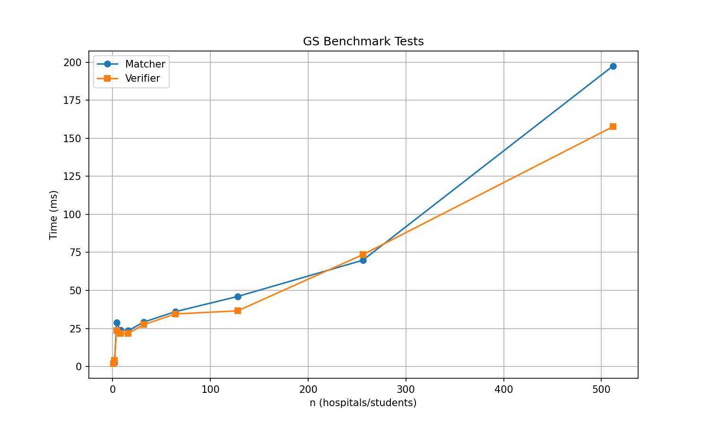

# secret-algo-pa1

- **Legasse Remon** (UFID: 16447883)
- **Brynn Li** (UFID: 14196126)

## Structure

- [src/matcher.py](src/matcher.py) - Gale-Shapley algorithm implementation
- [src/verifier.py](src/verifier.py) - Matching validity and stability verifier
- [src/benchmark.py](src/benchmark.py) - Performance benchmarking tool
- [data/](data/) - Example input/output files
- [tests/](tests/) - Test files for verification

## Requirements/Compilation

- Python 3.6 or higher
- No external dependencies required (uses only standard library)

## Matcher

The matcher takes an input file containing hospital and student preferences and outputs a stable matching.

```bash
python src/matcher.py <input_file> [output_file]
```

For example:

```bash
# Output matching to console
python src/matcher.py data/example_1.in

# Output matching to a file
python src/matcher.py data/example_1.in output.out
```

## Verifier

The verifier checks if a given matching is valid and stable.

```bash
python src/verifier.py <input_file> <matching_file>
```

For example:

```bash
# Verify a matching
python src/verifier.py data/example_1.in data/example_1.out

# Verify against test files
python src/verifier.py data/example_1.in tests/unstable_matching.out
```

The verifier will return any one of the following for a given input:

- `VALID STABLE` - The matching is both valid and stable
- `INVALID: <error>` - The matching is invalid (e.g., duplicate assignments)
- `UNSTABLE: <blocking_pair>` - The matching has a blocking pair

### Input Format

```
n
h1_pref1 h1_pref2 ... h1_prefn
h2_pref1 h2_pref2 ... h2_prefn
...
hn_pref1 hn_pref2 ... hn_prefn
s1_pref1 s1_pref2 ... s1_prefn
s2_pref1 s2_pref2 ... s2_prefn
...
sn_pref1 sn_pref2 ... sn_prefn
```

- Line 1: `n` - Number of hospitals and students
- Lines 2 to n+1: Hospital preference lists (1-indexed, space-separated)
- Lines n+2 to 2n+1: Student preference lists (1-indexed, space-separated)

### Output Format

```
hospital_id student_id
hospital_id student_id
...
```

Each line contains a hospital ID and its matched student ID. They are 0-indexed inputted and 1-indexed processed and space-separated.

For example in data/:
Input (`data/example_1.in`):

```
3
1 2 3
2 3 1
2 1 3
2 1 3
1 2 3
1 2 3
```

Output (`data/example_1.out`):

```
1 1
2 2
3 3
```

## Assumptions

We give the following assumptions which are made in our algorithm:

1. Input files are well-formed with valid preference lists
2. All indices are 0-index processed and 1-indexed outputted
3. Each hospital and student appears exactly once in every preference list
4. The number of hospitals equals the number of students
5. Hospitals are the proposing side

## Performance

Our python program simple does an empirical runtime analysis of the matching algorithm versus the verifying algorithm. The time complexity of each is O(n^2).


